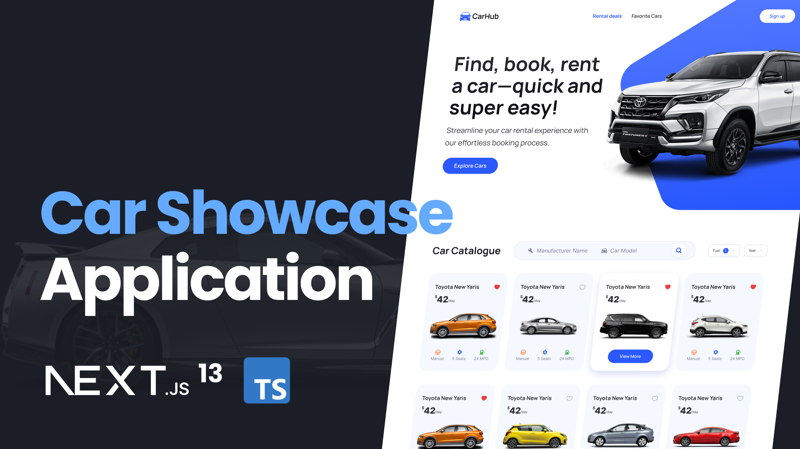

<h1>Modern Next.js 13 Application | React, Next JS 13, TypeScript, Tailwind CSS</h1>
 
  
 
<b>Main features:</b>
<ul>
    <li>Use Next.js 13 App Router and Server Side Rendering</li>
    <li>Use React, Typescript, Tailwind, Headless UI & multiple API</li>
    <li>Implement Advanced Search Functionality</li>
    <li>Create Filtering Capabilities</li>
    <li>Optimize Metadata and SEO</li>
    <li>Create custom filter, combobox, and modal elements</li>
    <li>Maintain a well-organized file and folder structure.</li>
</ul>

 
